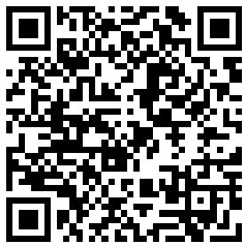
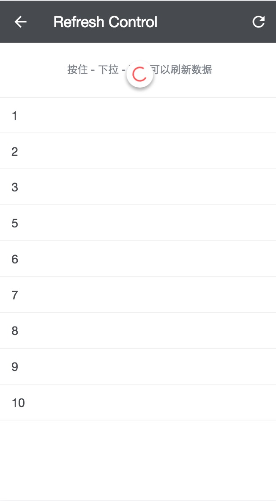

# vue-carbon

基于 vuejs 1.0 开发 material design 风格的移动端 WEB UI 库, 设计资源参考 [CARBON](http://materialmockups.com/) [FrameWork7](https://github.com/nolimits4web/Framework7)

在线访问地址 [vue-carbon demos](https://myronliu347.github.io/vue-carbon/)

也可以扫描二维码



## 链接

[Vue Carbon 使用文档 v0.4.2](https://myronliu347.github.io/vue-carbon/book/v0.4.2)

[Muse UI](https://museui.github.io) 基于 Vue 2.0 开发 material design ui

## 安装

目前只使用与 npm 安装，和使用 webpack 项目的应用

```shell
npm install vue-carbon --save
```

```javascript
import Vue from 'vue'
import VueCarbon from 'vue-carbon'
import 'vue-carbon/dist/vue-carbon.css' // 加载文件
Vue.use(VueCarbon)
```


## 简单使用

例如这个 Refresh Control 组件的demo页面


```html
<template>
<div class="vc-page">
  <header-bar>
    <icon-button slot="left" @click="back()" icon="arrow_back"></icon-button>
    <span>Refresh Control</span>
    <icon-button slot="right" @click="refresh()" icon="refresh"></icon-button>
  </header-bar>
  <content v-el:trigger>
    <refresh-control @refresh="refresh" :trigger="$els.trigger" :refreshing="refreshing"></refresh-control>
    <content-block>
      <p class="refresh-desc">
         按住 - 下拉 - 释放可以刷新数据
      </p>
    </content-block>
    <list>
      <item-cell v-for="item in items">
        <item-title>
          {{item}}
        </item-title>
      </item-cell>
    </list>
  </content>
</div>
</template>

<script>
export default {
  data () {
    return {
      items: ['1', '2', '3', '5', '6', '7', '8', '9', '10'],
      end: 10,
      refreshing: false
    }
  },
  methods: {
    back () {
      window.history.back()
    },
    refresh () {
      this.refreshing = true
      setTimeout(() => {
        this.refreshing = false
        var arr = []
        for (let i = this.end; i < this.end + 10; i++) {
          arr.push(String(i + 1))
        }
        this.end += 10
        this.items = arr
      }, 2000)
    }
  }
}
</script>

<style lang="less">
.refresh-desc{
  text-align: center;
}
</style>
```

效果如下




## Licence

vue-carbon is open source and released under the MIT Licence.

Copyright (c) 2016 myron
